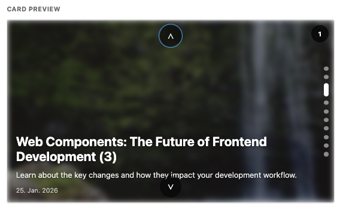

# RSS Feed Metro Tile

[](https://github.com/custom-components/hacs)
[](https://github.com/falconfs/ha-rssfeedMetroTile/releases)
[](LICENSE)

A modern Home Assistant Lovelace card that displays RSS feed entries as animated Metro-style tiles with customizable transitions and layouts.



## ✨ Features

- 🎨 **Metro-Style Design** - Beautiful, modern tile-based interface
- 📱 **Fully Responsive** - Works on desktop, tablet, and mobile
- 🪟 **Modal View** - Open RSS links in customizable modal overlays (NEW!)
- 🎯 **Touch Gestures** - Swipe to navigate slides
- ⌨️ **Keyboard Navigation** - Arrow keys support
- 🎬 **Multiple Transitions** - Vertical slide, horizontal slide, fade
- 🖼️ **Flexible Layouts** - Background blur or split layout for images
- 📐 **Aspect Ratio Control** - Square (1:1), widescreen (16:9), or custom
- ⏸️ **Pause on Hover** - Auto-pause when hovering or touching
- 🎛️ **Visual Editor** - Easy configuration through UI
- 🌙 **Theme Support** - Respects Home Assistant light/dark themes
- ♿ **Accessible** - ARIA labels, keyboard support, reduced motion support
- 🖥️ **Sections View Compatible** - Works with new grid-based layouts

## 📦 Installation

### HACS (Recommended)

1. Open HACS in your Home Assistant instance
2. Go to "Frontend"
3. Click the menu (⋮) and select "Custom repositories"
4. Add `https://github.com/falconfs/ha-rssfeedMetroTile` as repository
5. Category: Lovelace
6. Click "Install"
7. Refresh your browser

### Manual Installation

1. Download `rssfeed-metro-tile.js` from the [latest release](https://github.com/falconfs/ha-rssfeedMetroTile/releases)
2. Copy to `<config>/www/rssfeed-metro-tile.js`
3. Add resource to Lovelace:

```yaml
resources:
  - url: /local/rssfeed-metro-tile.js
    type: module
```

4. Refresh your browser

## 🚀 Quick Start

### 1. Create an RSS Feed Sensor

First, add a Feedreader sensor to your `configuration.yaml`:

```yaml
feedreader:
  urls:
    - https://www.home-assistant.io/atom.xml
  scan_interval:
    minutes: 30
```

### 2. Add the Card

Add the card through the UI or in YAML:

**UI Method:**

1. Click "Add Card" in your dashboard
2. Search for "RSS Feed Metro Tile"
3. Select your feed entity
4. Configure options

**YAML Method:**

```yaml
type: custom:rssfeed-metro-tile
entity: sensor.home_assistant_blog
```

## ⚙️ Configuration

### Basic Configuration

```yaml
type: custom:rssfeed-metro-tile
entity: sensor.rss_feed
slide_duration_sec: 5
show_images: true
row_limit: 10
```

### Full Configuration

```yaml
type: custom:rssfeed-metro-tile
entity: sensor.rss_feed

# Layout
aspect_ratio: '1:1' # "1:1", "16:9", "4:3" or empty for dynamic
tile_height_px: 300 # Used when aspect_ratio is empty
image_layout: background # "background" or "split"

# Carousel
slide_duration_sec: 5
transition: slide-vertical # "slide-vertical", "slide-horizontal", "fade"
auto_play: true
pause_on_hover: true

# Content
row_limit: 10 # Limit feed items (0 = all)
show_images: true
lazy_load_images: true

# Navigation
show_navigation: true # Show prev/next arrows
show_indicators: true # Show dot indicators
keyboard_navigation: true # Enable arrow keys

# Modal Settings
open_in_modal: true # Open links in modal (default: true)
modal_type: custom # "custom" or "ha-dialog"
modal_size: medium # "small", "medium", "large", "fullscreen"
modal_width: '' # Custom width (e.g. "800px" or "80%")
modal_height: '' # Custom height (e.g. "600px" or "70%")
modal_animation: fade # "fade", "slide-up", "scale", "none"
modal_close_on_backdrop: true # Close on backdrop click
modal_show_close_button: true # Show X button
modal_close_on_esc: true # Close on ESC key
modal_show_loading: true # Show loading spinner
modal_fallback_to_external: true # Open externally if CORS blocks

# Grid Layout (Sections View)
grid_rows: 4
grid_columns: 4

# Advanced
performance_warning: 20 # Warn if feed has more than X items
style: |
  .slide-title { color: cyan; }
```

### Configuration Options

| Option                       | Type    | Default            | Description                                                           |
| ---------------------------- | ------- | ------------------ | --------------------------------------------------------------------- |
| `entity`                     | string  | **required**       | RSS feed sensor entity                                                |
| `aspect_ratio`               | string  | `""`               | Aspect ratio: `"1:1"`, `"16:9"`, `"4:3"` or empty for container-based |
| `tile_height_px`             | number  | `300`              | Fixed height in pixels (when no aspect_ratio)                         |
| `slide_duration_sec`         | number  | `5`                | Seconds per slide                                                     |
| `transition`                 | string  | `"slide-vertical"` | Transition effect                                                     |
| `image_layout`               | string  | `"background"`     | Image layout: `"background"` or `"split"`                             |
| `auto_play`                  | boolean | `true`             | Auto-advance slides                                                   |
| `pause_on_hover`             | boolean | `true`             | Pause on hover/touch                                                  |
| `row_limit`                  | number  | `0`                | Limit feed items (0 = all)                                            |
| `show_images`                | boolean | `true`             | Display images                                                        |
| `lazy_load_images`           | boolean | `true`             | Lazy load images                                                      |
| `show_navigation`            | boolean | `true`             | Show prev/next buttons                                                |
| `show_indicators`            | boolean | `true`             | Show dot indicators                                                   |
| `keyboard_navigation`        | boolean | `true`             | Enable keyboard controls                                              |
| `open_in_modal`              | boolean | `true`             | Open links in modal overlay                                           |
| `modal_type`                 | string  | `"custom"`         | Modal type: `"custom"`, `"ha-dialog"`, or `"none"` (direct external)  |
| `modal_size`                 | string  | `"medium"`         | Modal size: `"small"`, `"medium"`, `"large"`, `"fullscreen"`          |
| `modal_width`                | string  | `""`               | Custom modal width (e.g. `"800px"`, `"80%"`)                          |
| `modal_height`               | string  | `""`               | Custom modal height (e.g. `"600px"`, `"70%"`)                         |
| `modal_animation`            | string  | `"fade"`           | Animation: `"fade"`, `"slide-up"`, `"scale"`, `"none"`                |
| `modal_close_on_backdrop`    | boolean | `true`             | Close modal on backdrop click                                         |
| `modal_show_close_button`    | boolean | `true`             | Show close button in modal                                            |
| `modal_close_on_esc`         | boolean | `true`             | Close modal on ESC key                                                |
| `modal_show_loading`         | boolean | `true`             | Show loading spinner while loading                                    |
| `modal_fallback_to_external` | boolean | `true`             | Open link externally if CORS blocks iframe                            |
| `grid_rows`                  | number  | `4`                | Rows in sections view                                                 |
| `grid_columns`               | number  | `4`                | Columns in sections view                                              |
| `performance_warning`        | number  | `20`               | Warn when feed exceeds X items                                        |
| `style`                      | string  | `""`               | Custom CSS styles                                                     |

## 🪟 Modal Features

### Opening Links in Modal

By default, clicking on a news tile opens the website in a modal overlay instead of a new tab. This provides a seamless browsing experience without leaving your Home Assistant dashboard.

**Key Features:**

- 🎯 **Three Modal Types**:
  - Custom modal (iframe) - Default
  - Home Assistant dialog integration
  - Direct external link (no modal, no iframe issues)
- 📏 **Flexible Sizing**: Predefined sizes (small/medium/large/fullscreen) or custom dimensions
- 🎬 **Animated**: Multiple animation styles (fade, slide-up, scale) or none
- 📱 **Mobile Optimized**: Auto-fullscreen on small screens (< 720px)
- ⚡ **Loading States**: Shows spinner while loading website
- 🛡️ **CORS Handling**: iframe errors trigger automatic fallback to external link
- ⌨️ **Keyboard Support**: Close with ESC key, backdrop click, or close button

### Modal Configuration Examples

#### Direct External Link (No Modal, No CORS Issues)

```yaml
type: custom:rssfeed-metro-tile
entity: sensor.news_feed
modal_type: none # Opens directly in new tab - no iframe issues!
```

#### Large Modal with Slide-Up Animation

```yaml
type: custom:rssfeed-metro-tile
entity: sensor.news_feed
modal_size: large
modal_animation: slide-up
```

#### Custom Sized Modal

```yaml
type: custom:rssfeed-metro-tile
entity: sensor.blog_feed
modal_width: '1200px'
modal_height: '800px'
modal_animation: scale
```

#### Disable Modal (Use External Links)

```yaml
type: custom:rssfeed-metro-tile
entity: sensor.rss_feed
open_in_modal: false
```

#### Home Assistant Dialog Integration

```yaml
type: custom:rssfeed-metro-tile
entity: sensor.news_feed
modal_type: ha-dialog
modal_size: fullscreen
```

### CORS and iframe Limitations

Many modern websites block iframe embedding for security reasons (X-Frame-Options, Content-Security-Policy headers).

**Solutions:**

1. **Use `modal_type: none`** (Recommended) - Opens links directly in new tab, no iframe issues
2. **Automatic Fallback** - When iframe fails to load, card automatically opens link externally after 2 seconds
3. **Manual Fallback** - Click "Open in New Tab" button in error state

**Common sites that block iframes:** Google, Facebook, Twitter, banking sites, many news sites

### Mobile Responsiveness

On devices with screen width < 720px, modals automatically switch to fullscreen mode for optimal viewing experience.

## 🎨 Examples

### Square Tile with Fade Transition

```yaml
type: custom:rssfeed-metro-tile
entity: sensor.news_feed
aspect_ratio: '1:1'
transition: fade
slide_duration_sec: 7
```

### Split Layout for News

```yaml
type: custom:rssfeed-metro-tile
entity: sensor.bbc_news
image_layout: split
show_navigation: true
show_indicators: false
```

### Minimal Configuration

```yaml
type: custom:rssfeed-metro-tile
entity: sensor.blog_feed
aspect_ratio: '16:9'
show_navigation: false
show_indicators: false
```

## 🎯 Use Cases

- **News Feeds** - Display latest news from RSS feeds
- **Blog Updates** - Show recent blog posts
- **Social Media** - RSS feeds from social platforms
- **Weather Updates** - Weather service RSS feeds
- **Event Announcements** - Community event feeds

## 🐛 Troubleshooting

### Card doesn't show up

- Clear browser cache (Ctrl+F5)
- Check browser console for errors
- Verify the resource is loaded in Developer Tools → Resources

### Feed is empty

- Check that your RSS feed sensor has entries: Developer Tools → States → `sensor.your_feed`
- Verify the sensor has an `entries` attribute
- Try restarting Home Assistant

### Images not loading

- Check CORS settings if using external images
- Verify image URLs are accessible
- Try disabling lazy loading: `lazy_load_images: false`

### Performance issues

- Reduce `row_limit` to show fewer items
- Increase `slide_duration_sec`
- Disable images with `show_images: false`

## 🙏 Acknowledgments

- Inspired by Windows Metro design
- Built with [Lit](https://lit.dev/)
- Uses [custom-card-helpers](https://github.com/custom-cards/custom-card-helpers)

## 📝 License

MIT License - see [LICENSE](LICENSE) file for details

## 🤝 Contributing

Contributions are welcome! Please feel free to submit a Pull Request.

1. Fork the repository
2. Create your feature branch (`git checkout -b feature/AmazingFeature`)
3. Commit your changes (`git commit -m 'Add some AmazingFeature'`)
4. Push to the branch (`git push origin feature/AmazingFeature`)
5. Open a Pull Request

## 🔗 Links

- [Home Assistant](https://www.home-assistant.io/)
- [HACS](https://hacs.xyz/)
- [Report Issues](https://github.com/falconfs/ha-rssfeedMetroTile/issues)
- [Discussions](https://github.com/falconfs/ha-rssfeedMetroTile/discussions)

---

Made with ❤️ for Home Assistant
